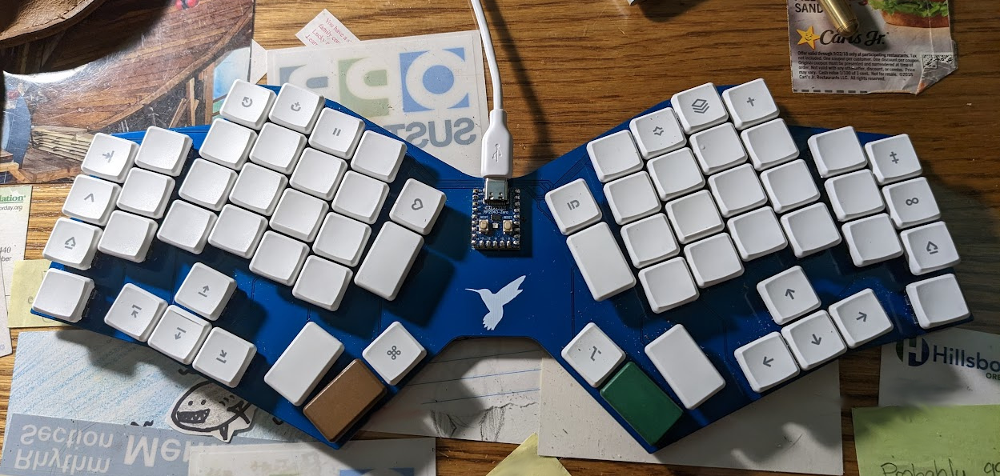
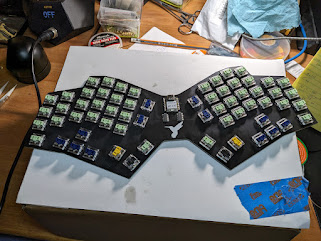
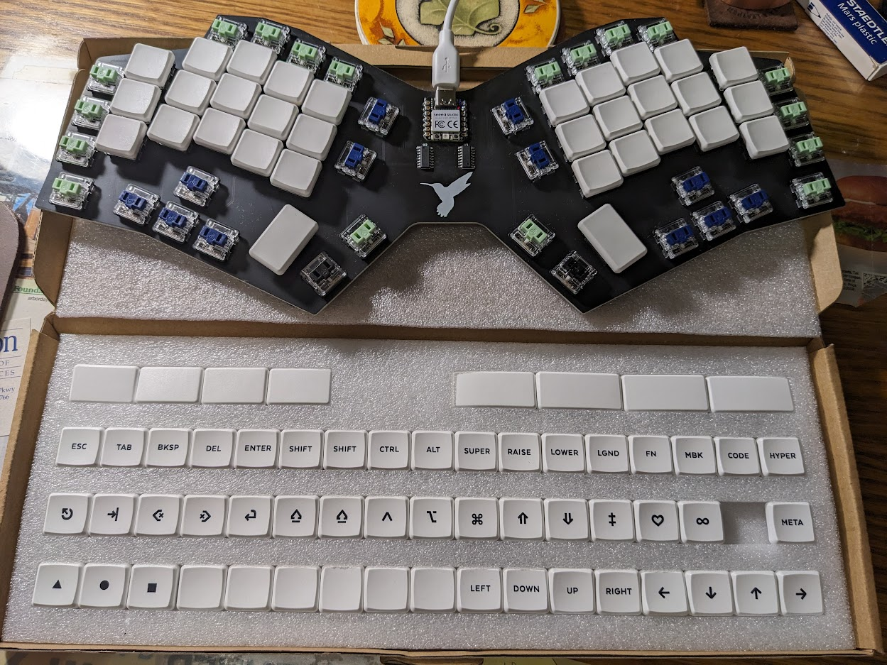
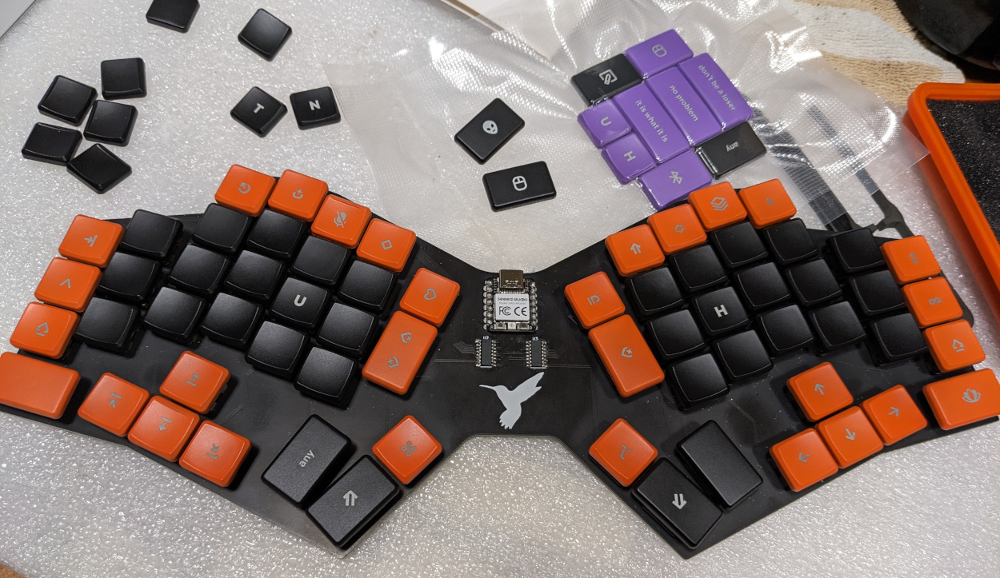
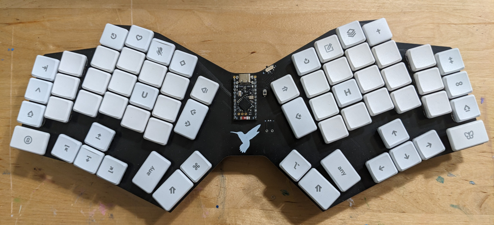
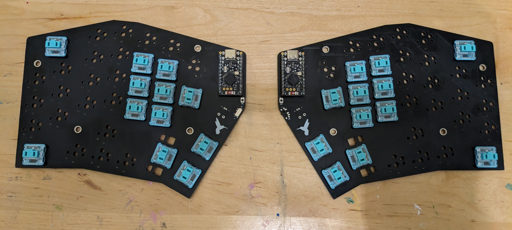

# Introduction
BumWings is an ergonomic keyboard design that has several variants with different key configurations.  Some variants use the Waveshare RP2040-zero board which features a Raspberry Pi RP2040 MCU.  Other variants use the Xiao Seeed family of controllers.  Additionally, I've created a new variant (64-key) that uses a nice!nano or compatible MCU.  These designs represent my first attempts at an all-new keyboard PCB design, but obviously I have been influenced by many other keyboard designs (including open-source, closed-source and commercial).

## Design and Implementation

BumWings uses an "un-split" angled ergonomic matrix that has columnar stagger with moderate pinky splay, and features dual inverted T-clusters and modest thumb key clusters.  It is a fairly large board that also gives space for the hands to stay apart and rest at an angle, which works well for me.

The controller board can either be soldered directly to the PCB, or socketed pin headers can alternately be used.

Credit is given to Pete Johanson for the Xiao footprint, circuit design and other aspects from his [revxlp keyboard design](https://gitlab.com/lpgalaxy/revxlp).

This design uses Kailh "Choc" PG1350 key switches.  The board can either be used bare or installed in a case.  For those who prefer a case, I have uploaded a set of PCB case files for a Corne-style board arrangement (with both top plate and bottom plate).  Other case options are still a work in progress.  I am open to using a 3D-printed case, but currently lack the capability (and I don't have a 3D printer); interested individuals who want to help me develop a 3D-printed case should contact me.

## Revisions

The original designs (labeled as "v001", committed in December 2022 and January 2023) represent my first attmept to create a keyboard PCB design.  I learned several things, including the undeniable fact that relatively large PCBs are somewhat more expensive to produce. 

I also learned that my hand-soldering skills were **not** that great.  

These learnings were applied to the "revised" or "remixed" designs (labeled as "v001R", committed in July 2023) which improve on the original "v001" design in some subtle ways.  These are in the "v001R" subdirectory.  I recommend that new users start with the designs in the "v001R" subdirectory.

## Pictures - Work in Progress

Here is a picture of my first prototype build of the initial "v001" RP2040 variant with 54 keys.  It has Kailh Choc Robin switches (mostly).

Here is a picture of the new "v001R" RP2040 variant with 64 keys.  This is now my "daily driver" keyboard.  It has Kailh Choc Brown switches (mostly).

Here are two pictures of the new "v001R" Xiao variant with 64 keys.  This keyboard will be a gift for a friend.  It has Kailh Choc Jade switches (mostly).

Here's another board, this one using the excellent Kailh Choc Sunset switches (mostly) with custom keycaps.

(more pictures coming soon)

## Future Directions

Update 2024/July: I have some new things to show!

