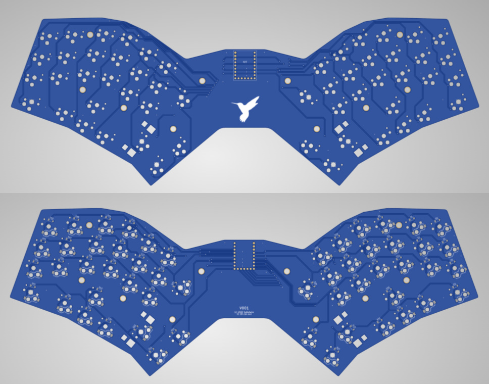
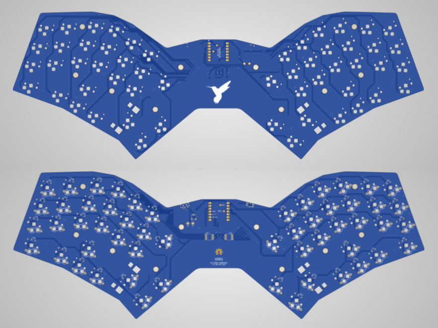
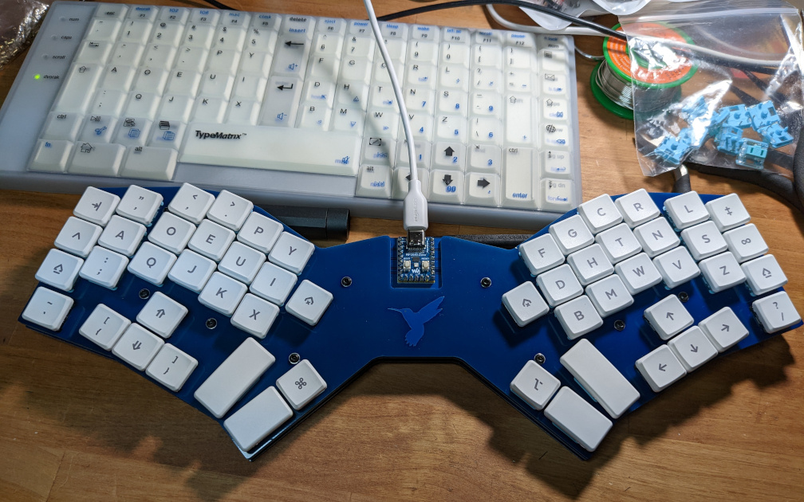

# Introduction
BumWings is an ergonomic keyboard design that has two variants:  one that uses the Waveshare RP2040-zero board which features a Raspberry Pi RP2040 MCU, and another that uses the Xiao Seeed family of controllers.   This design is my first attempt at an all-new keyboard PCB design, but obviously it has been influenced by many other keyboard designs (both open-source, closed-source and commercial).

## Design and Implementation

BumWings uses an "un-split" angled ergonomic matrix that has columnar stagger with moderate pinky splay, and features dual inverted T-clusters and modest thumb key clusters.  It is a fairly large board that also gives space for the hands to stay apart and rest at an angle, which works well for me.

The controller board can either be soldered directly to the PCB, or socketed pin headers can alternately be used.

Credit is given to Pete Johanson for the Xiao footprint, circuit design and other aspects from his [revxlp keyboard design](https://gitlab.com/lpgalaxy/revxlp).

This design uses Kailh "Choc" PG1350 key switches.  The board can either be used bare (not recommended) or installed in a case.  I have uploaded a set of PCB case files for a Corne-style board arrangement (with both top plate and bottom plate).  Other case options are still a work in progress.

The board renders for the Waveshare RP2040-zero variant are shown below:

The board renders for the Xiao Seeed variant are shown below:

Here is a picture of my first prototype build:

