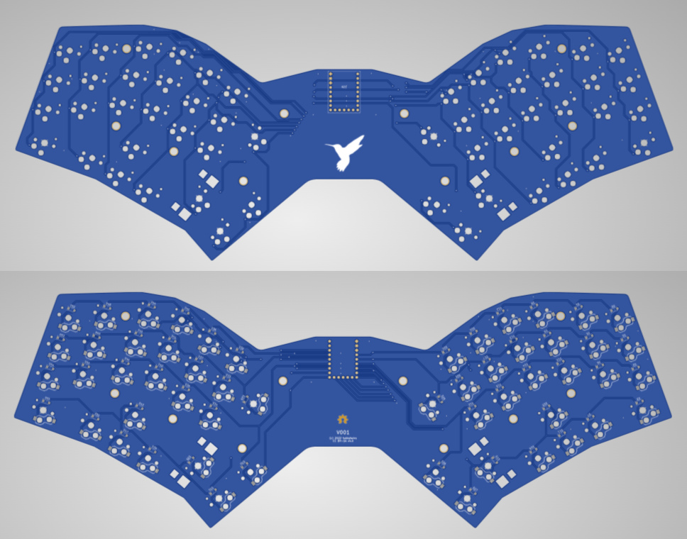
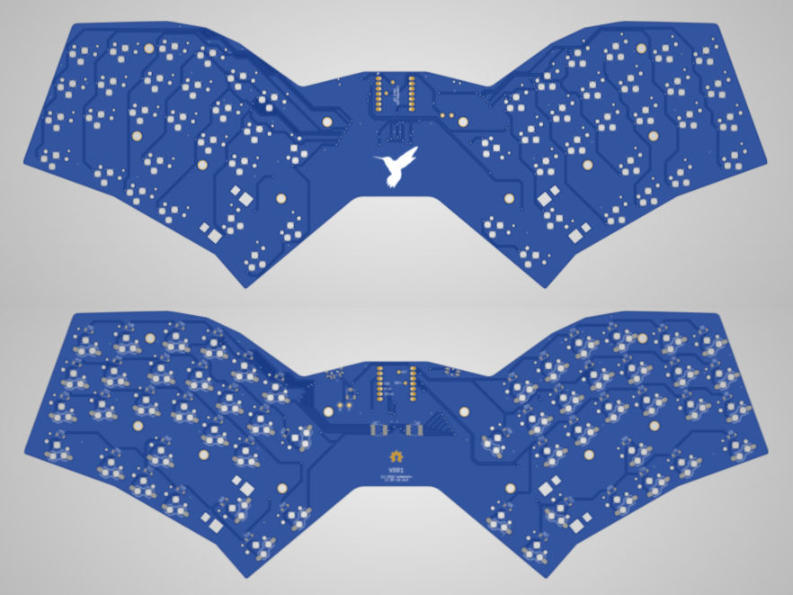

# V001

I used JLCPCB to build the first prototype PCBs for this version.  It works nicely.

See "info.md" for more information about the background and inspiration for this keyboard design.

## List of Variants

*   "pcb_core52840" - 54-key hot-swap PCB based on the Waveshare Core52840 module
*   "pcb_rp2040zero" - 54-key hot-swap PCB based on Waveshare RP2040 "zero" controller
*   "pcb_xiao" - 54-key hot-swap PCB based on the Seeed Xiao controller
*   "pcb_xiao_s" - simplified 54-key direct-soldered PCB based on the Seeed Xiao controller

## Pictures

The board renders for the Waveshare RP2040-zero variant are shown below:

The board renders for the Xiao Seeed variant are shown below:

The board renders for the slightly simplified Xiao Seeed variant are shown below:

## Bill of Materials

## All variants

Diodes:  54x D_SOD-123

Sockets:  54x Kailh Choc hot-swap (for all variants except "pcb_xiao_s") (again, you will need 54 of them)

Key caps:  MBK (either plain, or with legends, at your discretion)

Other resistors/etc:  none

### Waveshare RP2040 variant

MCU:     Waveshare RP2040 "zero" (23-pin module with USB-C port) - you can find these on Amazon for a higher price, or on Aliexpress or eBay for a lower price.  They can either be plain, or with pre-soldered pin headers.

### Xiao Seeed variant

MCU:     Xiao Seeed controller of your choice - you can find these from many suppliers

Shift Register:  2x 74HC595PW or SN74HC595PW (in TSSOP-16 format) - you can find these from many suppliers, usually around USD $1.50 for a pack of 10

Reset switch and power switch:  optional, stay tuned...

### Xiao Seeed Simplified variant

MCU:    Xiao Seeed controller (as above)

Shift Register:  2x 74HC595PW or SN74HC595PW (in TSSOP-16 format)

No reset or power switch.  This variant is intended for non-wireless (and non-battery-powered) builds.  The Xiao Seeed RP2040 controller works very well for this variant, and I expect that the SAMD21 controller would also work very well.

For this variant, all components are direct-soldered to the front of the PCB (except the key switches, obviously).

### Waveshare Core52840 variant

MCU:     Waveshare Core52840 module, featuring Nordic Semiconductor's nRF52840

Alternate: HolyIOT 18010 module (which is apparently pin-compatible...)

Other components as follows:  (based heavily on Rafael Yumagulov's "Dao-Choc-BLE" board, but I replaced all 0603-size components with 1206-size components, to make it easier for hand-soldering)
https://github.com/yumagulovrn/dao-choc-ble

| Reference    | Name                      | Package  | Value           | Qty  |
|--------------|---------------------------|----------|-----------------|------|
| BT1          | JST                       | ?        | 1.25mm 2pin 90° | 1    |
| C1-C2, C4-C5 | Capacitor                 | 1206     | 10uF            | 4    |
| C3           | Capacitor                 | 1206     | 1nF             | 1    |
| C6-C7        | Capacitor                 | 1206     | 4.7uF           | 2    |
| D0-D55       | Diode                     | SOD-123  | 1N4148WS        | 54   |
| D56          | Diode                     | SOD-123  | 1N5819W         | 1    |
| D57          | LED                       | 1206     | BLUE            | 1    |
| D58          | LED                       | 1206     | RED             | 1    |
| F1           | Fuse                      | 1206     | 500mA           | 1    |
| J1           | USB Receptacle            | ?        | ?               | 1    |
| Q1           | P-Mosfet                  | SOT-23   | AO3401A         | 1    |
| R1-R2        | Resistor                  | 1206     | 5.1k            | 2    |
| R3           | Resistor                  | 1206     | 4.7             | 1    |
| R4           | Resistor                  | 1206     | 1M              | 1    |
| R5a          | Resistor                  | 1206     | 750k            | 1    |
| R5b          | Resistor                  | 1206     | 56k             | 1    |
| R6-R7        | Resistor                  | 1206     | 1k              | 2    |
| R8           | Resistor                  | 1206     | 2M              | 1    |
| R9           | Resistor                  | 1206     | **RPROG****     | 1    |
| R10          | Resistor                  | 1206     | 100k            | 1    |
| SW0-SW55     | Kailh Choc Hotswap Socket | ?        | ?               | 54   |
| SW56         | SPDT Switch               | ?        | MSK-12C02       | 1    |
| SW57         | Tactile Button            | ?        | TS-1086E        | 1    |
| U1           | MCU                       | ?        | Core52840       | 1    |
| U2           | ESD Protection IC         | SOT-23-6 | USBLC6-2SC6     | 1    |
| U3           | Voltage Regulator IC      | SOT-23-5 | XC6220          | 1    |
| U4           | Battery Charging IC       | SOT-23-5 | MCP73831        | 1    |

In the Dao-Choc-BLE design, the designer offered an alternate value of 820k for "R5"; however, for such a voltage sensing circuit (for battery status) a resistor of 820k will give somewhat invalid values.  In my design, I opted to use two resistors that added up to 806k, which is the recommended value.

**RPROG**** Value depends on your battery capacity. For 300mAh battery should be 3.3K

